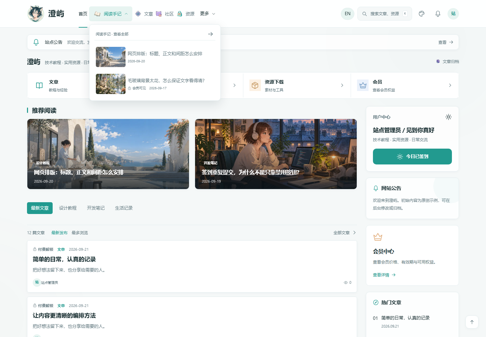
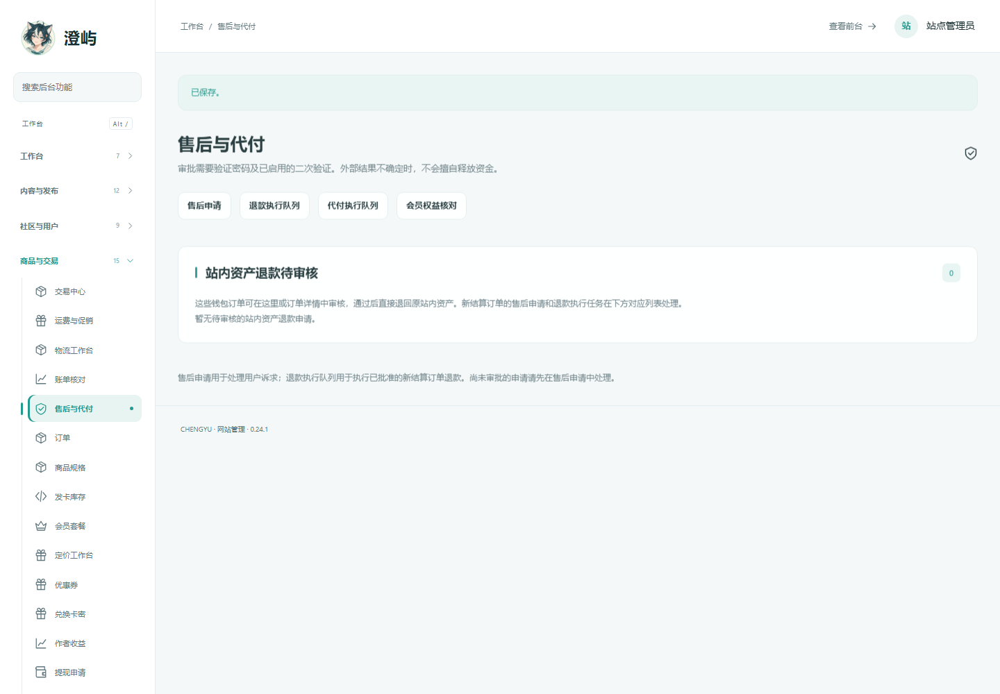
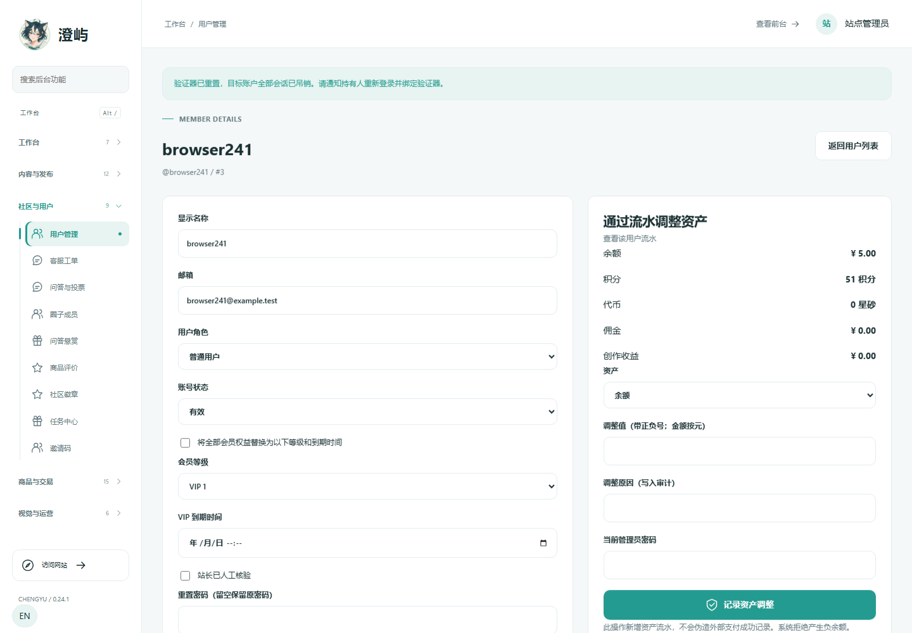

# 澄屿 Chengyu

**内容、社区与交易，放在你自己的站点里。**

[](https://github.com/yiran168/chengyu/releases/latest)
[](https://github.com/yiran168/chengyu/actions/workflows/php.yml)
[](docs/COMPATIBILITY.md)
[](LICENSE)

澄屿是一套可自行部署的 PHP 内容与社区系统，包含读者前台、用户中心和管理后台。写文章、运营问答与圈子、发布付费资源、管理订单，都在同一个站点完成。界面支持后台调整布局、配色、导航、图标与图片。

无需 WordPress、前端构建、运行期 Composer、Redis 或常驻队列。支持原生 PDO MySQL / SQLite；文件上传使用内置内容识别，不要求 Fileinfo 扩展。

**[下载安装](https://github.com/yiran168/chengyu/releases/latest) · [在线阅读部署说明](docs/DEPLOYMENT.md) · [升级已有网站](docs/UPGRADE.md) · [功能范围](docs/FEATURE_MATRIX.md) · [反馈问题](https://github.com/yiran168/chengyu/issues)**

## 看看界面



| 售后工作台 | 账户安全管理 |
| --- | --- |
|  |  |

前台截图来自 0.24.0，展示本版继续保留的布局；后台截图来自 0.24.1 的隔离测试站点。更多操作截图与说明在完整包的 `START_HERE.html` 中。

## 能做什么

| 场景 | 已有能力 |
| --- | --- |
| 写作与阅读 | 文章、分类、标签、专题、快讯、归档、搜索、评论；免费、登录、会员与付费访问 |
| 社区互动 | 问答与采纳、投票、圈子、私信、通知、工单及作者主页 |
| 内容经营 | 数字资源、会员、积分与余额、资源版本与私有下载、作者收益、推荐返佣 |
| 商品与售后 | 商品规格、库存、卡密、实物订单、多包裹物流、收货、退款、账单核对 |
| 外观与编排 | 三层图文导航、22 种布局区块、草稿与发布、FAQ 编辑、统一图片选择器；可替换的原创插画与图标 |
| 账户与运维 | 角色权限、双重验证与恢复码、会话吊销、审计、邀请码、加密备份与恢复、运行环境检查 |

功能的前置条件、数量限制和第三方接口范围详见 [功能矩阵](docs/FEATURE_MATRIX.md)。支付、邮件、对象存储等外部服务需要配置自己的服务账号及主机网络权限。

## 开始部署

### 1. 选择下载包

前往 [Releases](https://github.com/yiran168/chengyu/releases/latest)，按用途选择：

| 文件 | 用途 |
| --- | --- |
| `chengyu-0.24.1-upload.zip` | 新站部署；解压后的内容直接放入网站根目录 |
| `chengyu-0.24.1-complete.zip` | 完整源码、测试、工具、截图与离线手册 |
| `chengyu-0.24.1-patch-from-0.23.1.zip` | 已有 0.23.1—0.24.0 网站的累计升级补丁 |
| `chengyu-0.24.1-manual.html` | 单文件离线操作手册 |
| `chengyu-0.24.1-SHA256SUMS.txt` | 发布附件的完整性校验值 |

部署请使用 `upload.zip`，GitHub 自动生成的 “Source code” 压缩包是整个仓库。

### 2. 确认环境

| 项目 | 要求 |
| --- | --- |
| PHP | 64 位 PHP 7.4—8.5，使用同一套业务功能 |
| 数据库 | PDO MySQL 或 PDO SQLite；MySQL 使用 InnoDB、utf8mb4 |
| 扩展 | OpenSSL；无需 Fileinfo |
| 目录 | 应用与存储目录可写；SQLite 数据库必须在公开目录之外 |
| Web 服务 | 按部署说明设置入口、目录保护与伪静态；HTTPS 用于在线收款等功能 |

虚拟主机、面板 VPS 和无面板 VPS 的操作见 [部署说明](docs/DEPLOYMENT.md)。安装页会检查当前实例的环境；服务商不同套餐的限制需要在自己的主机上确认。

### 3. 安装新网站

1. 在自己的电脑上打开包内 `DEPLOY_PREPARE.html`，生成本站独立安装口令，保存 `key.php` 和私密的 `INSTALL_KEY.txt`。
2. 将上传包解压到网站根目录，保留 `.htaccess`、`web.config` 等隐藏配置文件。
3. 用生成的 `key.php` 覆盖服务器 `install/key.php`。**`INSTALL_KEY.txt` 留在本地，不上传。**
4. 创建空 MySQL 数据库，访问 `/install/`，填写数据库信息和自己的管理员账号。
5. 安装后进入 `/admin/`，核对设置并删除服务器上的 `install` 目录。

公开发行包没有通用安装密码或默认管理员。已有站点应按 [升级说明](docs/UPGRADE.md) 保留原配置、secret、数据库与 `storage`，不重新安装。

## 0.24.1 更新

- 流水按用户筛选，列表、记录总数和分页保持一致。
- 修复保存后跳转导致成功提示丢失；上传头像立即预览并标明是否已保存。
- 邀请码停用后可以恢复，同时检查到期时间和剩余次数。
- 售后工作台集中展示普通钱包退款待办，与订单详情复用审核表单。
- 增加管理员双重验证恢复，核对身份、吊销旧会话并记录审计；补充无 SSH 主机的恢复方法。
- 修正错误订单的会员升级退款误报，补齐中文提示和游客登录引导。

数据库结构保持 **v16**。查看 [本版操作说明](docs/PLATFORM_0241.md) 或 [完整变更记录](docs/CHANGELOG.md)。

## 测试与兼容性

每次发布都保留实际结果和验证范围，不只列出目标版本。

| 本版验证 | 结果 |
| --- | --- |
| 本地 PHP 7.4—8.5，Fileinfo 开启 / 关闭 | 14 组原生 PDO SQLite 测试，每组 **769 项通过** |
| PHP 7.4 / 8.2 / 8.5，关闭 Fileinfo | 每个版本 **1,188 项 HTTP 检查通过** |
| 重点浏览器操作 | **38 项通过**，覆盖退款、账户恢复、资料保存、头像预览等 |
| Linux 原生 MySQL / SQLite | **28 个数据库 / 扩展状态全部通过**；SQLite 每组 769 项，MySQL 每组 770 项 |

**[测试报告与原始证据](docs/TEST_REPORT.md) · [GitHub Actions](https://github.com/yiran168/chengyu/actions/workflows/php.yml) · [真实主机验收](docs/ACCEPTANCE_018.md)**

蓝队云、萌哒云的实际账号、VPS 装机及真实支付商户环境尚未联调；语言与数据库测试不能替代具体主机验收。历史截图、旧版测试和本版结果分别记录。

## 开发与贡献

```text
site/           可部署应用：入口、业务代码、模板、静态资源
tests/          隔离核心、HTTP 与浏览器测试
tools/          安装准备、恢复、手册与打包工具
deploy/         Web 服务配置与 VPS 部署脚本
docs/           使用说明、设计记录、测试证据与截图
RELEASE.json    当前版本及验证元数据
```

在隔离开发环境执行核心测试：

```bash
php tests/run.php > core-results.json
```

MySQL、HTTP 与浏览器测试的依赖和命令见 [开发者测试说明](tests/README.md)。测试会创建临时账户、订单和数据库，请勿连接生产数据。

欢迎提交 Issue 或 Pull Request。问题报告请附版本、PHP / 数据库环境、最小复现步骤和脱敏错误日志；不要提交数据库密码、安装口令、支付密钥或用户隐私。安全问题请先说明影响范围，与维护者确认复现材料的提供方式，避免公开可攻击线上站点的信息。

## 文档导航

| 想做的事 | 从这里开始 |
| --- | --- |
| 安装 / 升级 | [新站部署](docs/DEPLOYMENT.md) · [保留数据升级](docs/UPGRADE.md) |
| 运营与外观 | [后台指南](docs/ADMIN_GUIDE.md) · [动效设置](docs/MOTION_GUIDE.md) · [素材与图片](docs/ARTWORK.md) |
| 交易与安全 | [支付与资产](docs/PAYMENTS.md) · [备份恢复](docs/BACKUP_RECOVERY.md) · [双重验证恢复](docs/ACCOUNT_RECOVERY.md) |
| 兼容与原理 | [文件类型识别](docs/FILE_TYPES.md) · [架构](docs/ARCHITECTURE.md) · [参考实现分析](docs/REFERENCE_024.md) |
| English | [Quick start](docs/EN_QUICKSTART.md) |

## 许可证

[MIT](LICENSE) © Chengyu contributors。

参考主题用于研究功能与交互。本仓库不分发其专有代码、素材、字体或授权逻辑，也不依赖 WordPress 运行时；原创生成图像的来源记录见 [ARTWORK.md](docs/ARTWORK.md)。
